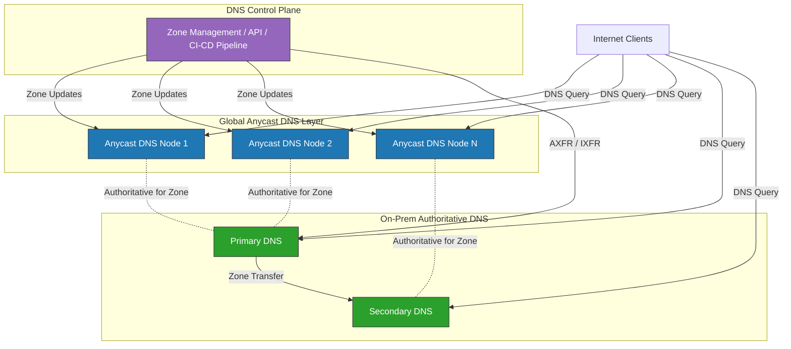

# Hybrid DNS

A hybrid DNS configuration combines globally distributed, anycast-based authoritative DNS nodes with on-premises authoritative DNS servers integrated into the same zone authority, to deliver resilient, low-latency, and sovereign DNS resolution.

## Control Plane vs. Data Plane Separation

* **Control plane**: zone management, updates, policy enforcement (can be centralized or dual-managed)
* **Data plane**: distributed query answering across cloud and on-prem endpoints

### Multi-Tier Authoritative DNS

The globally distributed edge layer provides anycast routing for low-latency resolution and high DDoS absorption capacity, while the on-premises layer provides local control over zone data and integration with internal systems and governance controls

### Shared Zone Authority

Both cloud and on-prem servers are authoritative for the same zones. Zone data is synchronized via AXFR/IXFR transfers, or API-driven propagation pipelines

## Resilience through Redundancy
The hybrid setup eliminates the single-provider dependency when moving a public DNS resolver to a CDN provider. Integrating Anycast with on-premises bind instances prohibits a "single point of failure" inherent in relying solely on a cloud provider or a single data center and inherits operational souvereignty. In a DDoS attack, Anycast Protection spreads the load across dozens of global nodes, effectively "absorbing" the traffic. If the global provider suffers a massive routing leak or a regional fiber cut, on-premises Fallback nodes continue to serve local traffic. This ensures that internal operations remain functional even if the "outside world" is struggling.

## Low Latency
Speed in DNS is determined by the "Physical Distance" between the recursive resolver and the authoritative server. In a hybrid setup, the Anycast edge handles most queries close to clients, while local instances serve local systems. For internet users, an Anycast node in a nearby Point of Presence (POP) ensures sub-30ms resolution. For local infrastructure inside a data center or a private cloud, an on-premises authoritative server provides near-zero latency. By placing the server on the same LAN or high-speed backbone as the applications it serves, systems bypass the "cold start" delays often found in public internet routing.

## Digital Sovereignty and Compliance
In an era of increasing data localization laws like GDPR or specialized financial regulations, where the data "lives" matters. Some organizations are legally or strategically required to retain authoritative capability and remain in control over critical data. The hybrid DNS setup allows operators to keep their "Master" zone files on hardware they physically own and to serve sensitive internal records strictly from on-premises nodes while using the global Anycast network to serve only public-facing records. This prevents internal network topography from being cached or analyzed by third-party global providers.

## Operational Consistency and Simplified Troubleshooting
Integrating multiple instance into the same zone authority rather than having separate internal and external views simplifies management. Maintaining a single zone authority makes it easier to manage DNSSEC signing keys. Operators don't have to worry about desynchronization between "Internal" and "External" views that often lead to validation failures. Engineers don't have to guess which "version" of a record is being hit. The hybrid approach ensures that whether a query hits a cloud node or a local server, the answer is cryptographically identical and consistent. 

## Key Properties
* **Operational flexibility**: Independent scaling of cloud and on-prem layers
* **Failover symmetry**: Either layer can serve the full zone if the other fails
* **Alternative Naming Options (Vendor-neutral)**
