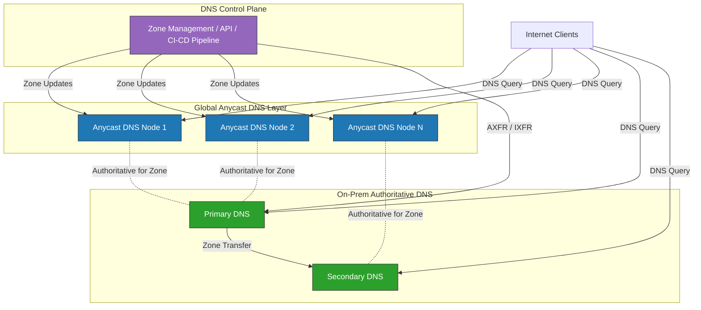

# Hybrid DNS

A hybrid DNS configuration combines globally distributed, anycast-based authoritative DNS nodes with on-premises authoritative DNS servers integrated into the same zone authority, to deliver resilient, low-latency, and sovereign DNS resolution. The model decouples the control plane, where zone management, policy enforcement, and record updates are centralized, from a highly resilient data plane. This data plane utilizes a multi-tier authoritative structure where a globally distributed anycast edge layer handles massive query volumes and absorbs DDoS attacks, while an on-premises layer provides ultra-low latency and sovereign control for local infrastructure. By maintaining a shared zone authority, both the cloud and on-prem tiers serve as the source of truth for the same zones, ensuring data consistency across all endpoints via synchronized transfer protocols like AXFR/IXFR or automated API-driven pipelines.

## Key Features

The project aims to make a Public DNS more reliable and to protect operational sovereignty by bridging the gap between global scale and local control. At its core, we utilize the free (rescile)[[https://www.rescile.com/]] to provide a unified, schema-driven source of truth that orchestrates complex infrastructure seamlessly across diverse environments. This approach ensures that whether our services sit at the anycast edge or on-premises, they remain consistent, resilient, and fully under a central governance.

| Feature | Global Anycast Only | On-Premises Only | Hybrid Integration |
| :--- | :--- | :--- | :--- |
| **DDoS Mitigation** | Excellent (Global absorption) | Poor (Limited by pipe size) | **Superior (Multi-layered)** |
| **Local Latency** | Low (30–50ms) | Ultra-Low (<5ms) | **Optimal (Best-path routing)** |
| **Data Sovereignty** | Third-party dependent | Full Control | **Controlled Exposure** |
| **Control Plane** | Centralized/Cloud-native | Localized | **Unified Management** |
| **Operational Risk** | Provider-dependent | Hardware-dependent | **Distributed/Redundant** |
| **Implementation** | Simple | Moderate | **Complex** |

### Resilience through Redundancy
The hybrid setup eliminates the single-provider dependency when moving a public DNS resolver to a CDN provider. Integrating Anycast with on-premises bind instances prohibits a "single point of failure" inherent in relying solely on a cloud provider or a single data center and inherits operational souvereignty. In a DDoS attack, Anycast Protection spreads the load across dozens of global nodes, effectively "absorbing" the traffic. If the global provider suffers a massive routing leak or a regional fiber cut, on-premises Fallback nodes continue to serve local traffic. This ensures that internal operations remain functional even if the "outside world" is struggling.

### Low Latency
Speed in DNS is determined by the "Physical Distance" between the recursive resolver and the authoritative server. In a hybrid setup, the Anycast edge handles most queries close to clients, while local instances serve local systems. For internet users, an Anycast node in a nearby Point of Presence (POP) ensures sub-30ms resolution. For local infrastructure inside a data center or a private cloud, an on-premises authoritative server provides near-zero latency. By placing the server on the same LAN or high-speed backbone as the applications it serves, systems bypass the "cold start" delays often found in public internet routing.

### Digital Sovereignty and Compliance
In an era of increasing data localization laws like GDPR or specialized financial regulations, where the data "lives" matters. Some organizations are legally or strategically required to retain authoritative capability and remain in control over critical data. The hybrid DNS setup allows operators to keep their "Master" zone files on hardware they physically own and to serve sensitive internal records strictly from on-premises nodes while using the global Anycast network to serve only public-facing records. This prevents internal network topography from being cached or analyzed by third-party global providers.

### Operational Consistency and Simplified Troubleshooting
Integrating multiple instance into the same zone authority rather than having separate internal and external views simplifies management. Maintaining a single zone authority makes it easier to manage DNSSEC signing keys. Operators don't have to worry about desynchronization between "Internal" and "External" views that often lead to validation failures. Engineers don't have to guess which "version" of a record is being hit. The hybrid approach ensures that whether a query hits a cloud node or a local server, the answer is cryptographically identical and consistent. 

## Contributing & Schema Governance

We welcome contributions that improve our automation or expand our hybrid DNS patterns. Because this project manages critical resources via a **Universal Configuration Server**, we maintain a high bar for stability and consistency.

### How to Get Started
1. **Fork** the repository.
2. Create a **feature branch** (`git checkout -b feature/schema-update-xyz`).
3. **Commit** your changes with descriptive messages.
4. Open a **Pull Request** and tag a maintainer for review.

### Rules of Engagement

* **Schema Consistency:** If your PR introduces new resource types or modifies existing definitions, you **must** update the corresponding `.rescile` schema files. Ensure all new fields include clear descriptions for the auto-generated documentation.
* **Backward Compatibility:** Schema updates should be additive whenever possible. If a breaking change is necessary (e.g., removing a field or changing a type), please flag it clearly in your PR description as a `BREAKING CHANGE`.
* **Validate Before You Push:** All configurations must be validated against the updated schema. Please ensure your YAML/JSON passes local `rescile-cli lint` (or equivalent) before submitting.
* **Idempotency is King:** Ensure that your code changes do not cause unnecessary resource destruction or "drift" on subsequent runs.
* **Security First:** Never commit secrets, API keys, or sensitive environment variables. Use placeholders or reference our supported secret management integration.

**Let’s build a more resilient, schema-driven infrastructure together!**
